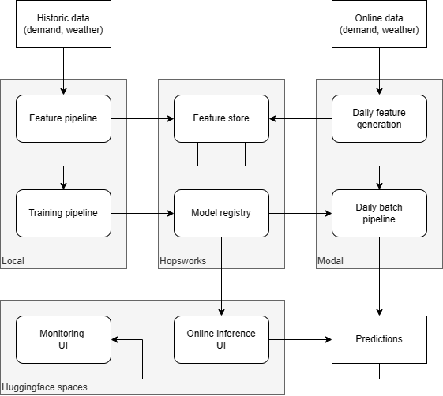
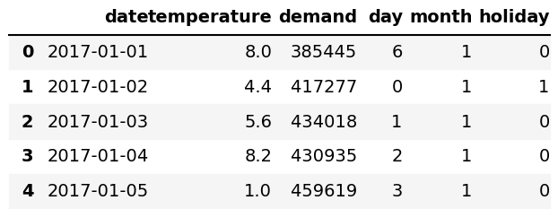

# Project - Predicting Daily Electricity Demand in New York, USA

The project is a machine learning prediction service that predicts the daily electricity demand in megawatthours in New York, USA. 

As features, the project uses historical daily demand, daily average temperature (celsius), and whether the date was a US Federal holiday or not. 

Training data consists of the years 2017 - 2021. The data for historical daily demand is obtained from [US Energy Information Administration (EIA)](https://www.eia.gov/) ([Link to API](https://www.eia.gov/opendata/browser/electricity/rto/daily-region-data)) and the data for historical average daily temperature is obtained from [National Oceanic and Atmospheric Administration (NOAA)](https://www.noaa.gov/). The US Federal holidays are obtained from the `USFederalHolidayCalendar` library in `pandas.tseries.holiday`. The temperature data for the daily scheduled batch predictions is obtained from [WeatherAPI](https://api.weatherapi.com/).

Along with the model's predictions we also provide the forecasted demand from EIA and find that our model's predicted values turn out to be fairly close to those of the official EIA forecast.

### Links

- Monitoring dashboard
    - https://rscolati-electricity-monitoring.hf.space/
    - The monitoring dashboard shows the historical record and performance of the model over time. The predictions are made on a daily basis.
- Interactive prediction service
    - https://rscolati-electricity.hf.space/
    - The interative prediction service is a UI to generate a prediction for the current day.  

## Pipelines

The prediction service is built using separate feature, training and inference pipelines, as described below. 
Hopsworks is used as feature store and model registry, daily instance generation and batch inference are deployed 
as functions in Modal and the UIs for online inference and monitoring are implemented using Hugginface spaces. 
The service architecture is (roughly) described in the following diagram.   

The source code for the feature, training, and inference pipelines as well as for the monitoring and online 
inference interfaces is implemented in [proj](.), and the main parts are briefly described below.  

### Feature pipeline 

Implemented in [`feature.ipynb`](feature.ipynb) as a Jupyter notebook. The features used for training and prediction
are daily demand for the NY area (prediction target), daily average temperature for the same area, day and month 
(represented as an integer feature) and bank holiday status (true or false, represented as a binary feature). 

To train the model and initialize the feature store with data, historic demand (from EIA) and weather data 
(from NOAA) for a span of 5 years (years 2017-2021) is used, in total 1826 instances. The data gathering and
preparation steps applied are the following.

1. Get demand (in MWh) data from EIA API
2. Get historic weather data (temperature in °C) from NOAA API
3. Merge dataframes on the date
4. Add "day", "month", and "holiday" (by comparing the date with the Pandas bank holiday database) features

Once the data is complete, the dataframe is uploaded to the Hopsworks feature store. The dataframe (first 5 
instances) is shown below.

### Training pipeline

Implemented in [`training.ipynb`](training.ipynb) as Jupyter notebook. The model used for the predictions is 
based on the XGBoost Regressor implemented in the 
[xgboost](https://xgboost.readthedocs.io/en/stable/python/python_intro.html) Python package. The model is trained 
on the historic demand and weather data prepared in the [Feature pipeline](#feature-pipeline). 

First the training data, retrieved from the feature store, is split in training (80%) and testing data (20%, 
used later to estimate the performance of the model). No particular data preparation techniques are used
except for imputation (even though we did not find any missing data) and Min-max normalization of the temperature. 
To avoid leaking information from the test split to the training split and to create a re-usable data preparation
pipeline which can be stored together with the model in the model registry, the data preparation is implemented
through Scikit-learn pipelines and fitted to the training data only. 

To find a reasonable hyperparameter configuration a randomized search with 10-fold cross validation is performed.
The best performing model, as measured using the mean average error (MAE), is then dumped (including the data
preparation pipeline) and uploaded to the model registry. The estimated MAE for the model, observed on the test 
set, is around 14GWh (around 3-4%) which seems to be in line with EIA's own forecasts.

### Daily feature pipeline

Implemented as a serverless function in [`feature-daily.py`](feature-daily.py). The daily feature pipeline runs on a daily basis as a scheduled function on [Modal](https://modal.com). The pipeline obtains daily demand and demand forecast from two days before the date of the run (for example, a run on Jan 15th will fetch values for Jan 13th). The EIA API is two days behind in terms of updating the actual demand which we require in order to ascertain the accuracy of our model's predictions. The feature pipeline also obtains the average temperature for that date and checks on whether the date is a bank holiday or not. Once all these features are collected and merged into a data frame it is then uploaded to the feature store.

### Daily batch pipeline

Implemented as a serverless function in `batch-daily.py`](batch-daily.py). The daily batch inference pipeline runs on a daily basis as a scheduled function on [Modal](https://modal.com). The pipeline pulls the feature group from the feature store and obtains the latest feature set added. The batch inference runs a prediction on this latest feature set and we compare the accuracy of our model by evaluating the Mean Absolute Error between the prediction and the actual demand. As part of the batch daily pipeline we also pull the EIA forecast for that date from the API and display the predicted demand, actual demand, and the EIA forecasted demand as part of our monitoring UI. This is done for evaluation purposes to compare how close our model is to the EIA's own forecast model. We find in some cases our model's predicted demand value is closer to the actual demand than the EIA forecast. Along with the historical prediction chart, the batch pipeline also creates the MAE trend chart and a table with the historical prediction records. All of this is then displayed on the Monitoring UI.